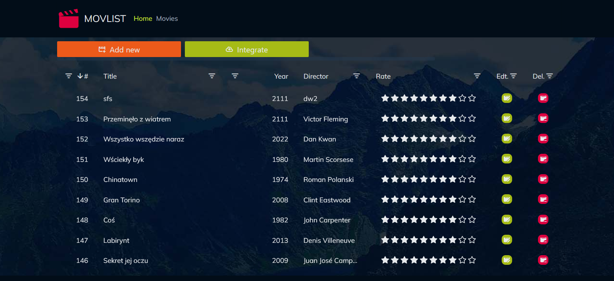

# MovList

## Usage

To get the project up and running, follow these steps:

1. **Frontend Setup**:
  - Navigate to the frontend directory.
  - Run `npm install` to install all necessary dependencies.

2. **Backend Setup**:
  - Navigate to the backend directory.
  - Run `dotnet run` to start the backend server.

3. **Automatic Frontend Launch**:
  - The project includes an SPA proxy configuration that will automatically start the frontend application when you run the backend server using `dotnet run`. This setup facilitates a smoother development experience by automatically launching the frontend and proxying API requests to the backend.

## Project Goal

The goal of the project is to create a full-stack application for managing a movie list. The application should enable:

- Displaying a non-paginated list of movies.
- Performing basic CRUD operations (Create, Read, Update, Delete) on this list.
- Fetching an additional list of movies from an external API.

Additional requirements include:

- **Form Validation**: `Vuelidate` is used for form validation to ensure data integrity and provide feedback to users.
- **Resilience to SQL Injection**: The application should be protected against SQL injection attacks.
- **Consistent Naming Conventions**: Follow a consistent naming convention for classes and other code elements.
- **Adherence to Language Coding Standards**: Code should conform to the style guidelines of the respective programming languages used.
- **User Interface**: The UI should be based on Bootstrap 5 or Tailwind CSS.
- **API Requests**: Use Axios for making requests between the web application and the API.
- **DevProxy Configuration**: Use DevProxy to handle CORS issues during development.
- **Error Handling**: Any errors resulting from API communication should be presented to the user in a manner other than console output.

## Technologies

The project is being developed using the following technologies:

- **Backend**: .NET 8
  - Utilizing the Mediator pattern.
  - Applying the Vertical Slices pattern.

- **Frontend**: Vue 3 + TypeScript
  - Using the Feature-Sliced Design pattern.

## Implementation Description

### Backend

- **Mediator Pattern**: Used to manage communication between different components of the application, facilitating easier scaling and code management.
- **Vertical Slices**: Organizing code by functionality (for example, grouping all movie-related operations in one place), which supports the Single Responsibility Principle and makes project management easier.

### Frontend

- **Feature-Sliced Design**: A frontend design methodology that involves breaking the application into functional modules. Each module is responsible for a specific function within the application, which simplifies code management and development.

## Additional Features

- **Fetching Movies from an External API**: The application has the capability to integrate with an external API to retrieve additional movie data.
